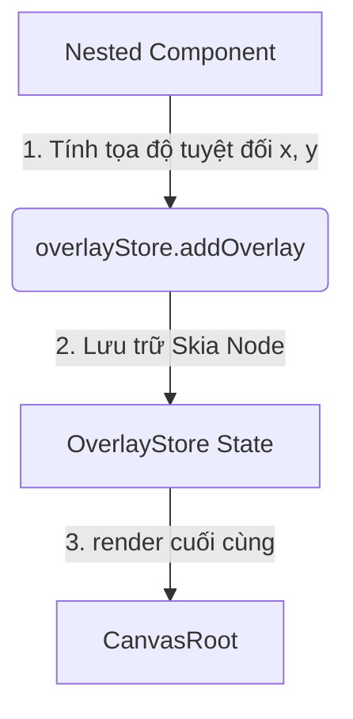

# Overlay Store (Skia Portal)

## Mục đích
- Quản lý các thành phần UI cần "nổi" lên trên cùng của ứng dụng (Z-index cao nhất).
- Giải quyết bài toán: Component được khai báo sâu bên trong (ví dụ: trong ScrollView bị bọc bởi `clip`) nhưng khi mở ra phải hiển thị vượt ra ngoài ranh giới đó (như Dropdown, Tooltip, Toast, BottomSheet, Context Menu).
- Hoạt động tương tự cơ chế `React.createPortal` hoặc `OverlayPortal` của Flutter.

## Kiến trúc



## Core Implementation

### 1. Store Definition (Zustand + Immer)

```ts
import { create } from 'zustand';
import { immer } from 'zustand/middleware/immer';
import { enableMapSet } from 'immer';
import { ReactNode } from 'react';

enableMapSet();

type OverlayEntry = {
  id: string;
  node: ReactNode;
  zIndex: number;
};

interface OverlayStore {
  overlays: Map<string, OverlayEntry>;
  
  // Thêm một giao diện vào lớp nổi
  showOverlay: (id: string, node: ReactNode, zIndex?: number) => void;
  // Xóa giao diện khỏi lớp nổi
  hideOverlay: (id: string) => void;
  // Xóa toàn bộ
  clearAll: () => void;
}

export const useOverlayStore = create<OverlayStore>()(immer((set) => ({
  overlays: new Map(),
  
  showOverlay: (id, node, zIndex = 100) => set((state) => {
    state.overlays.set(id, { id, node, zIndex });
  }),
  
  hideOverlay: (id) => set((state) => {
    state.overlays.delete(id);
  }),
  
  clearAll: () => set((state) => {
    state.overlays.clear();
  })
})));
```

### 2. Tái cấu trúc CanvasRoot

`<CanvasRoot>` cần lắng nghe kho lưu trữ này và vẽ TẤT CẢ con cưng của `overlayStore` sau cùng.

```tsx
export function CanvasRoot({ children, style }) {
  const { width, height } = useWindowDimensions();
  const handleTouch = useEventStore((state) => state.handleTouch);
  const overlays = useOverlayStore((state) => Array.from(state.overlays.values()));

  // Sort theo zIndex (bé vẽ trước, lớn vẽ sau đè lên)
  const sortedOverlays = overlays.sort((a, b) => a.zIndex - b.zIndex);

  return (
    <Canvas style={[{ width, height }, style]} onTouch={handleTouch}>
      {/* 1. Mọi UI bình thường của ứng dụng */}
      {children}
      
      {/* 2. OVERLAY LAYER — Luôn vẽ nằm trên cùng */}
      {sortedOverlays.map((overlay) => (
         <Group key={overlay.id}>
           {overlay.node}
         </Group>
      ))}
    </Canvas>
  );
}
```

### 3. Cách sử dụng (Ví dụ: Dropdown Item trong ScrollView)

```tsx
import { useOverlayStore } from 'react-native-skia-kit';
import { useWindowDimensions } from 'react-native';

export function DropdownInsideScroll({ x, y, width, height, options }) {
  const showOverlay = useOverlayStore(s => s.showOverlay);
  const hideOverlay = useOverlayStore(s => s.hideOverlay);

  const handleOpenDropdown = () => {
    // Tính toán tọa độ tuyệt đối (Absolute position trên Canvas)
    // Giả sử lấy được tọa độ global layoutXY từ Layout Store
    const globalX = measureGlobalX();
    const globalY = measureGlobalY();

    showOverlay('my-dropdown', (
      <Group>
        {/* Nền dim mờ bấm để đóng */}
        <Overlay visible onPress={() => hideOverlay('my-dropdown')} />
        
        {/* Menu xổ xuống nổi lên, không bị Scroll cắt */}
        <Box x={globalX} y={globalY + height} width={200} height={150} color="white" elevation={12}>
           {options.map((opt, i) => (
              <Text key={i} x={10} y={20 * i} text={opt} />
           ))}
        </Box>
      </Group>
    ));
  }

  return (
    <Button x={x} y={y} text="Chọn tùy chọn" onPress={handleOpenDropdown} />
  );
}
```

## Các Component sử dụng OverlayStore
- **Tooltip**: Hiển thị text hướng dẫn nổi trên các component khác.
- **Dropdown / Select Menu**: Danh sách xổ ra vượt ranh giới component cha.
- **Toast / Snackbar**: Thông báo tạm thời góc dưới màn hình.
- **Context Menu**: Menu mở ra khi nhấn giữ (long press).
